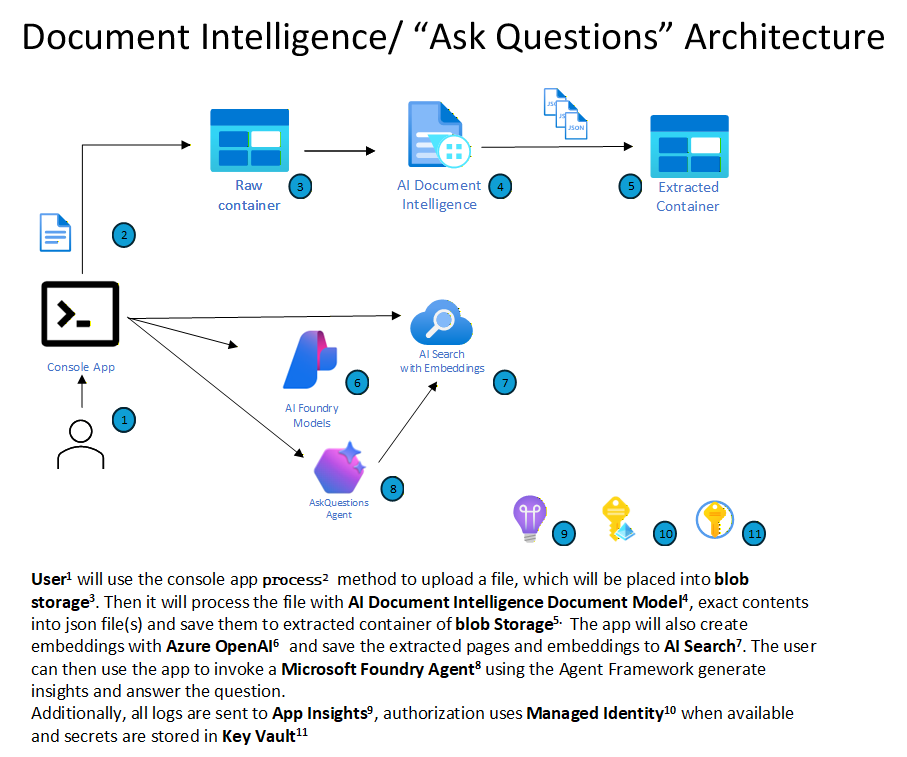
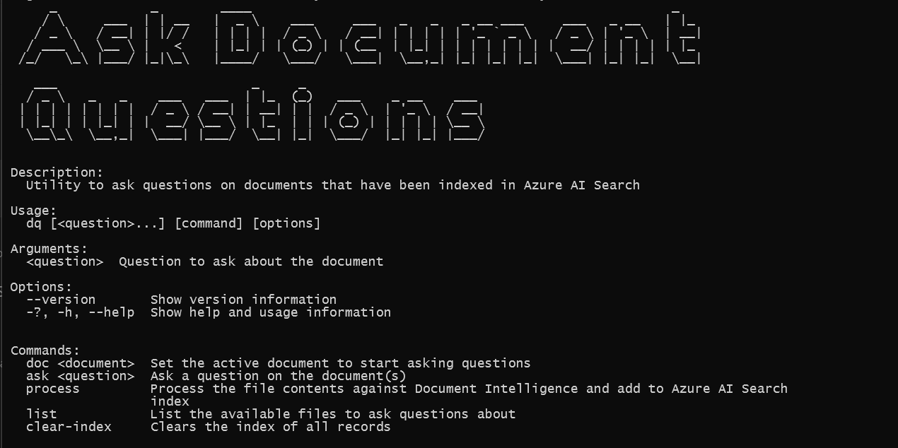

# Agent Framework and Microsoft Foundry: Ask Questions on your document


## Overview

This solution provides an example of how to process your own documents and then use [Microsoft Foundry](https://learn.microsoft.com/en-us/azure/ai-foundry/what-is-azure-ai-foundry) and [Microsoft Agent Framework](https://learn.microsoft.com/en-us/agent-framework/overview/agent-framework-overview) to ask question specific to that document.

**NOTE**: The console app is also provided to demonstrate how to use the AI Foundry and the Agent Framework to ask questions of an AI Agent.



## Updates

## What's Included

 This solution consists of:


- A console app to easily run and test locally with the following commands:
    - *process* - to process a file through document intelligence, then create embeddings and add the file to [Azure AI Search](https://learn.microsoft.com/en-us/azure/search/search-what-is-azure-search)
    - *doc* - to set the active document you want to ask questions about
    - *ask* - to ask you questions 

## Getting Started

### Prerequisites

- The deployment script can create a new Azure OpenAI Service for you however if you want to reuse an existing one, it will need to be in the same subscription where you are going to deploy your solution and retrieve its `Endpoint` and a `Key`.
- The PowerShell deployment script defaults to `gpt-5-mini` and `text-embedding-3-large` models with a deployment name matching the model name. If you have something different in your Azure OpenAI instance, you will want to pass in those values to the PowerShell command line deployed to your Azure OpenAI instance each with a deployment name matching the model name. Be aware, that using a different GPT model may result in max token violations with the example below.

### Deploying

Deployment is automated using PowerShell, the [Azure CLI](https://learn.microsoft.com/en-us/cli/azure/) and the [Azure Developer CLI](https://learn.microsoft.com/en-us/azure/developer/azure-developer-cli/). These can be easily installed on a Windows machine using `winget`:

``` bash
winget install --id "Microsoft.AzureCLI" --silent --accept-package-agreements --accept-source-agreements
winget install --id "Microsoft.Azd" --silent --accept-package-agreements --accept-source-agreements
```

**NOTE:** Since you will be deploying a new Azure OpenAI instance, be aware there are location limitations base on model. Please set your location value accordingly: 
[Region Availability](https://learn.microsoft.com/en-us/azure/ai-services/openai/concepts/models?tabs=global-standard%2Cstandard-chat-completions#model-summary-table-and-region-availability)

Also, depending on your availble Azure OpenAI model quota, you may get a capacity related deployment error. If you do, you will need to modify the `capacity` value for the appropriate model found in the [`infra/azureopenai.bicep`](infra/azureopenai.bicep) file


``` powershell
# Login to the Azure Developer CLI
azd auth login  
#if you have access to multiple tenants, you may want to specify the tenant id
azd auth login --tenant-id "<tenant guid>"

# provision the resources
azd up

#follow the prompts for the parameter values...
```

If successful, this process will create:

- Storage account with two blob containers (`raw` for uploaded documents and `extracted` for processed output)
- A Microsoft Foundry resource and project, with a `gpt-5-mini` and `text_embedding_3_large` deployments and a system assigned managed identiy
  - Role assigment for Cognitive Services identity for read access to `raw` container and write access to `extracted` container
- Azure Cognitive Search account
- Azure Document Intelligence Account
- Azure Application Insights resource automatically connected to the Microsoft Foundry project for telemetry and monitoring


### Running Samples via Console App

Along with the Azure deployment, the azd command will configure the local.settings.json file for the console app and the local funciton. To run the console app:

``` bash
dotnet run --project ./DocumentQuestionsConsole/DocumentQuestionsConsole.csproj
```

1. If this is your first time running the app or the Functions, you will not have any documents processed and you will be prompted to upload a document with the `process` 

   

2. Upload a document using the `process` command

   

3. Set the current document using the `doc` command

   

4. Start ask questions!

   

   

### Other Console App Features

- `list` - list all the documents processed

   

- `clear-index` - clear the index of all records

   

### What's next?

Try uploading your own documents and start asking question
